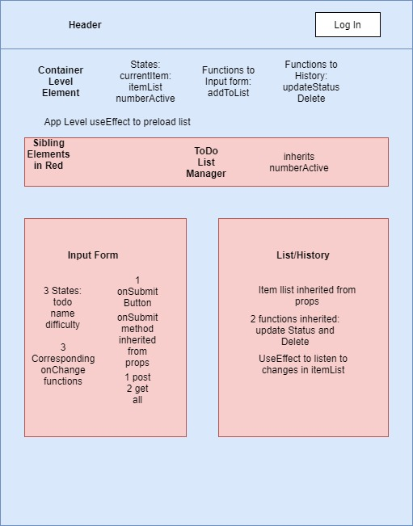

# React - To Do Lab

## Author: Davee Sok & Ryan Geddes

## Links and Resources:

<!-- - [ci/cd](http://xyz.com) (GitHub Actions) -->

- [Front-End application](https://agitated-sinoussi-efbc73.netlify.app/)
- [Back-End application- Authenticad API Server](https://davee-auth-api-server.herokuapp.com/api/v1/todo)

## Setup

### `.env` requirements:

<!-- i.e.
- `PORT` - Port Number
- `MONGODB_URI` - URL to the running mongo instance/db -->

```

```

### How to initialize/run this application:

<!-- - e.g. `npm start` -->

```

```

### Tests:

<!-- - How to run tests?
- Any tests of note?
- Describe any tests that you did not complete, skipped, etc -->

```

```

<hr>

## UML:



<hr>

## Our Notes:

Johns Example:  
https://todo-list-manager.netlify.app/  
username: admin  
password: ADMIN

### Setting Up React App:

```
npx create-react-app APP-NAME
cd APP-name
```

- Go to github
- Create a Repo

```
git remote add origin https://github.com/REPO
git remote -v
git push -f origin master
```

### Backend API used for development:

https://davee-auth-api-server.herokuapp.com/api/v1/todo

The following routes are available:

```
/signup
/signin

api/v1/categories
api/v1/products
api/v1/todo

api/v2/categories
api/v2/products
api/v2/todo
```

```
const todo = mongoose.Schema({
  text: { type: String, required: true },
  assignee: { type: String },
  complete: { type: Boolean, default:false },
  difficulty: { type: Number, default: 1 },
});
```
